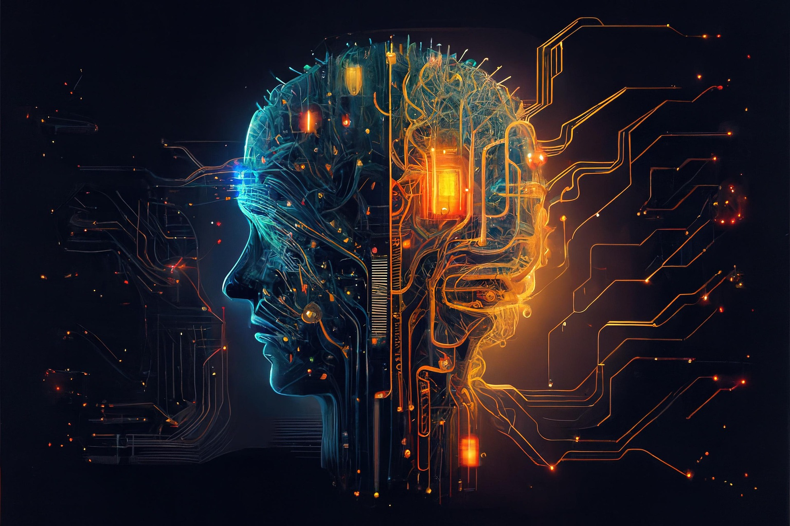
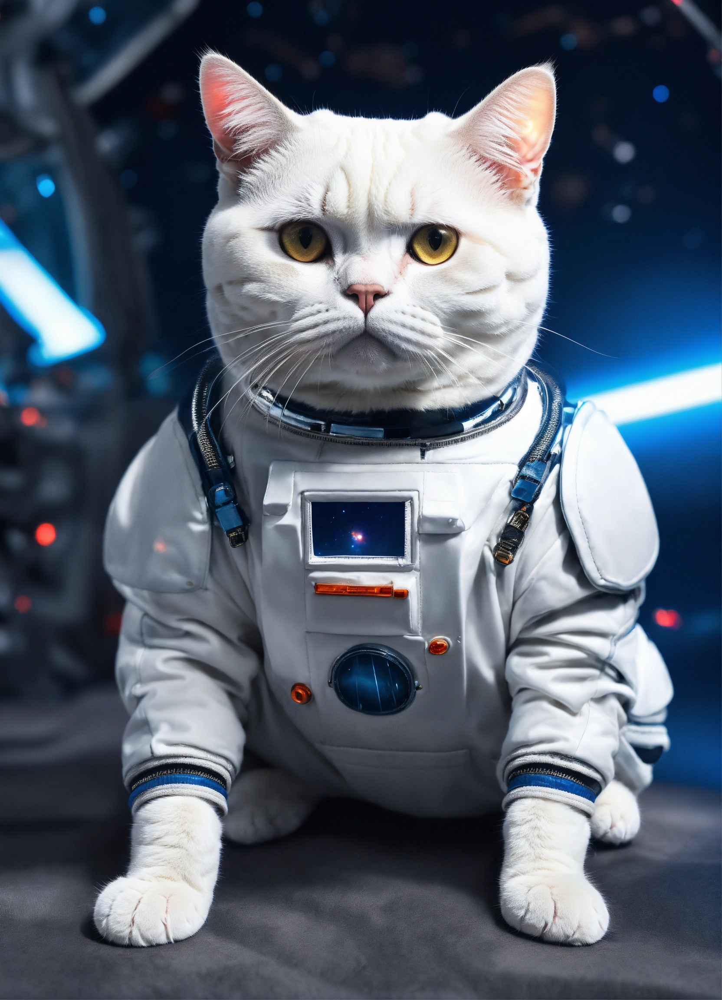
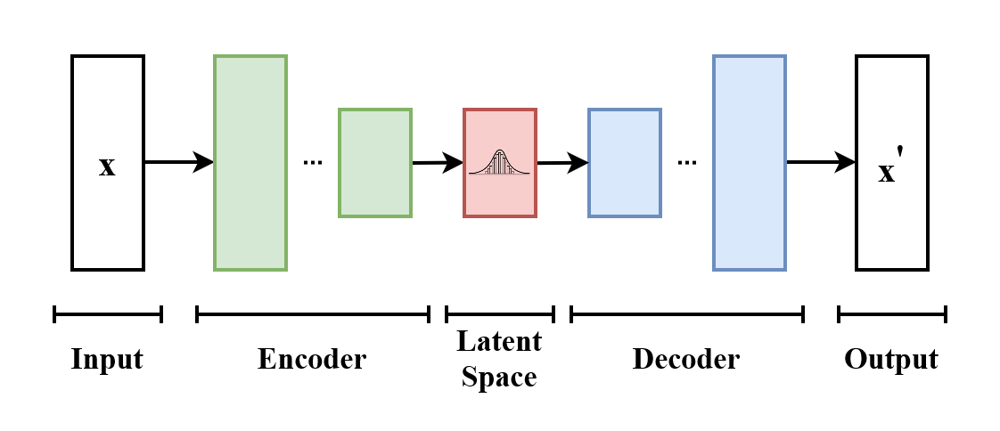

# When AI Learned to Dream: Generative AI in Computer Vision

> *"What if a computer could not just see the world — but imagine it?"*

---

## 1. What is Generative AI in Computer Vision?

### The detective and the painter

Imagine you have two friends.

The first one is a **detective**. You show her a photo of a cat and she immediately says: "Yep, that's a cat." She is brilliant at recognising things. That's classical AI in Computer Vision — it looks at images and figures out what they are.

The second friend is a **magical painter**. You walk up to him and whisper: *"Paint me a cat wearing a space suit, floating on the moon."* He nods, picks up his brush... and paints it. From nothing. A brand new image that never existed before.

That second friend? That is **Generative AI**.

*Figure 1: From simple recognition to creative imagination (Source: Unsplash/Pixabay).*

---

### The big shift

For a long time, AI was only the detective. It could:

- Recognise a face in a photo
- Detect whether a lung X-ray looked healthy
- Tell a cat from a dog

Then something changed. Researchers asked a new question:

> *"Instead of just understanding images — can AI create them?"*

And the answer turned out to be yes.

Today, Generative AI in Computer Vision means giving a machine the ability to **produce entirely new visual content** — images, faces, artwork, even videos — that it invented itself.

---

### Two real examples to make it click

**Example 1 — Generating human faces**

Go to [thispersondoesnotexist.com](https://thispersondoesnotexist.com). Every face you see there is 100% fake. No photographer took that photo. No model posed. A Generative AI invented every pixel.

*Example: A hyper-realistic face created by a GAN (Source: ThisPersonDoesNotExist).*

**Example 2 — Text to image**

Type *"a samurai frog riding a bicycle at sunset"* into a tool like DALL·E or Stable Diffusion. Seconds later, you get a picture of exactly that. Something no human ever drew. Something that never existed — until you asked.

*Example: A "Cat Astronaut" generated via Stable Diffusion on Hugging Face.*

---

## 2. Why use Generative AI?

Think about what it would mean to have an infinitely patient, incredibly fast artist sitting next to you — one who never sleeps, never charges by the hour, and can paint anything you describe in seconds.

That is the promise of Generative AI. Here is why it matters:

**Creativity on demand**
Designers, game developers, and filmmakers can generate concept art, characters, and scenes instantly.

**Helping AI learn faster**
Training an IA model requires thousands of labelled images. But what if you only have fifty real photos of a rare disease? Generative AI can create thousands of realistic fake ones to fill the gap. This is called *data augmentation*.

**Medicine and science**
Doctors can generate synthetic medical scans to train diagnostic models — without needing real patient data.

*Figure 2: Basic architecture of a VAE used to reconstruct and generate data (Source: Wikipedia Commons).*

> In short: Generative AI turns imagination into raw material.
> You think it, you describe it, and it exists.

---

Now that we understand *what* Generative AI is and *why* it matters, a natural question appears:

> **How exactly does a machine learn to create?**

The answer lies in three remarkable inventions — **GANs**, **VAEs**, and **Diffusion Models** — each with its own clever trick for teaching a computer to imagine.
Let's meet them one by one.